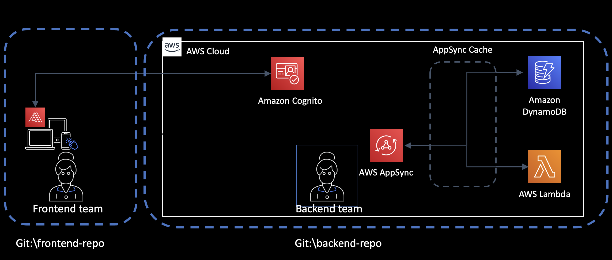
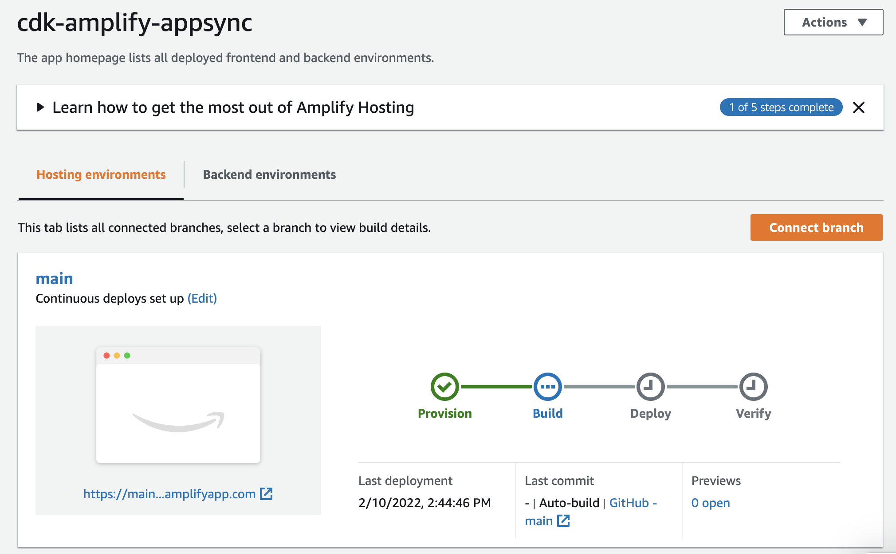
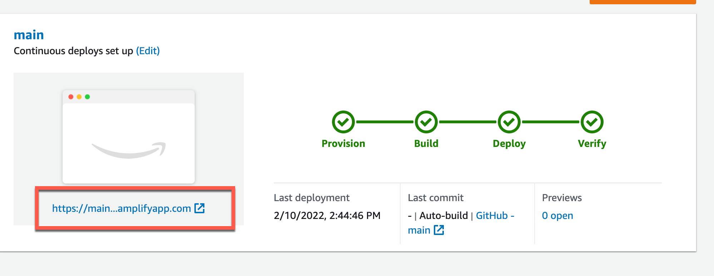

# Build a full-stack application with AWS CDK

_Infrastructure as code framework used_: AWS CDK, AWS Amplify
_AWS Services used_: AWS Amplify, AWS Cognito, AWS AppSync, AWS Lambda, AWS DynamoDB

## Summary of the demo

Deploying a web app to the cloud using good practices and also working with multiple teams can be challenging. We always see tutorials on how to use one or the other framework, when in reality in our organizations we have multiple teams working with multiple frameworks.

In this tutorla I want to show you how to combine AWS CDK and AWS Amplify to build a webapp using React and a backend serverless application.

In this demo you will see:

- How to create an AWS Amplify application using AWS CDK
- How to add authentication with Cognito with AWS CDK to the Amplify web app
- How to add a GraphQL endpoint to the AWS Amplify and create it using AWS CDK.
- How to deploy and host the webapp in the cloud.

This project is part of a video series posted in FooBar Serverless channel. You can check the video series to see the whole demo, the links are in the resource section.

## Application Arquitecture

This application has 2 parts. A client application and a backend application, and both are meant to existis in to different GitHub projects.

The client application is a React webapp, that will use Amplify libraries to connect to the backend. And will be hosted using Amplify console.

The backend application is a serverless application, consisting in an Amplify app, a cognito user pool and identity pool, an AppSync endpoint with two datasources.

The AppSync endpoint is generated using the 3rd party constructor [CDK AppSync Transformer](https://github.com/kcwinner/cdk-appsync-transformer).



## Deploy this demo from your machine

We will be using AWS CDK to deploy this project. Install CDK according to the [instructions](https://aws.amazon.com/cdk/).
This project is still using CDK version 1. A migrated version of this project will be available soon.

First you will need to put the client project in a GitHub repo. Also generate a GitHub developer token and store it in the Secret Store (check the video tutorial for the steps).

Then copy the config.example.json file and create a config.json. In that file put the right name of the webapp repo, the owner and the branch.

Then you can deploy the backend to the cloud:

```
$ cd backend
$ npm install ## you only need to do this the first time
$ npm run build
$ cdk deploy
```

After you deploy all the resources are created and you can go to the Amplify console.
You will see that the webapp is provisioning.



When the deployment of the webapp is done, you can get the URL for it and open it on a browser.



### Delete this application

The whole application deletes with this command.
After you run it, your Amplify application won't exists as well any of the backend resources created.

```
$ cdk destroy
```

## Links related to this code

You can find all the steps by step on how to build this demo.

- Part 1: Create the AWS Amplify application using CDK: https://www.youtube.com/watch?v=mSKQlV3lRYw
- Part 2: Add an existing Amazon Cognito user pool and identity pool to an Amplify App using AWS CDK: https://www.youtube.com/watch?v=FydiAbf4iZI
- Part 3: Create a GraphQL endpoint and datasources in the simplest way possible - AppSync with CDK: https://youtu.be/U2T9P2A_fHk

If you want to learn more there is a whole blog post with a lot of resources on this topic: https://blog.marcia.dev/amplify-cdk
